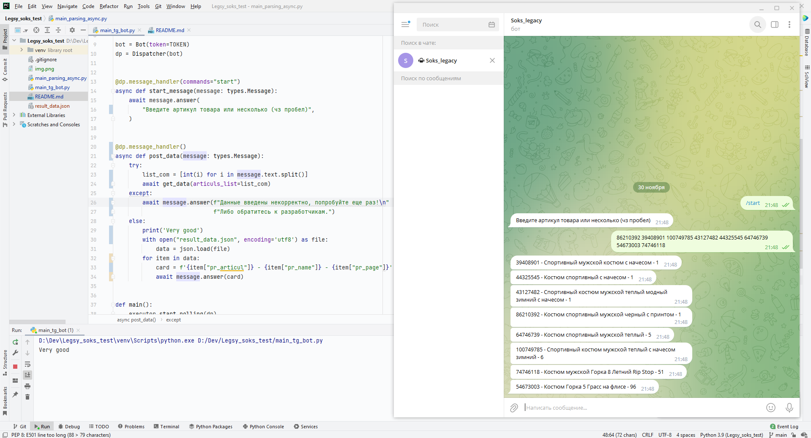

## Legsy_soks_test

### Стек технологий
 
 
 
 


### Описание проекта
1. Через инспектор CHROME нашел нужный эндпоинт отвечающий за артикул Товаров. По нему и спарсил данные.
<br>*файл "main_parsing_async.py"
2. После создал ТГ бота по ссылке <a href="https://t.me/Soks_legacy_bot">Soks_legacy</a> 
3. Чтобы бот заработал нужно запустить скрипт в файле "main_tg_bot.py"<br>
Вводим в <a href="https://t.me/Soks_legacy_bot">ТГ-боте</a> команду **/start** 
<br>После оповещения Бота о готовности к поиску – нужно ввести артикул Товар(-а/-ов), к. вы ищите через пробел.
<br>
<br>Ждем несколько секунд! 
<br>И Бот должен выдать подобную информацию (Артикул - Название_товара - Страница_с_товаром)
<br><br>



### ps
Перед запуском программы не забываем установить виртуальное окружение и зависимости
```
WIN: python -m venv venv
MAC: python3 -m venv venv

WIN: source venv/scripts/activate
MAC: source venv/bin/activate

WIN: python -m pip install --upgrade pip
MAC: python3 -m pip install --upgrade pip

pip install -r requirements.txt
```


